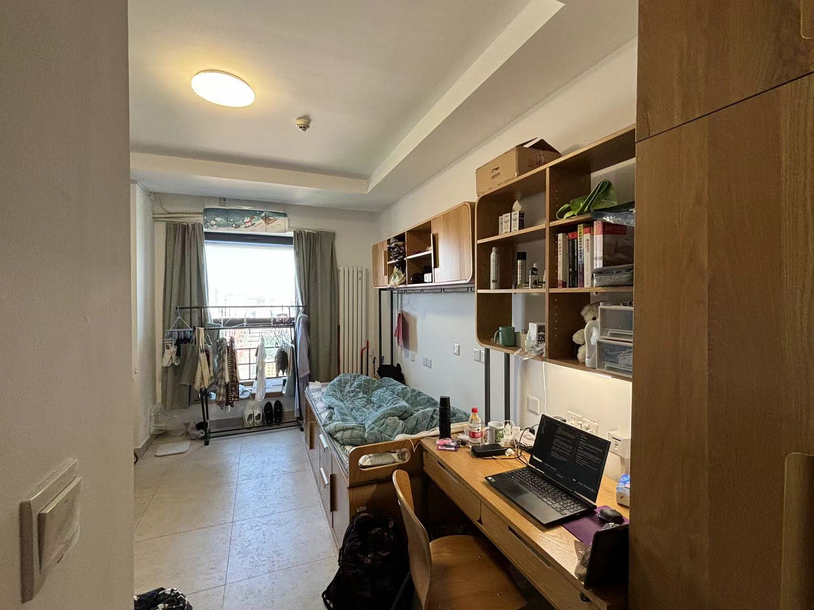
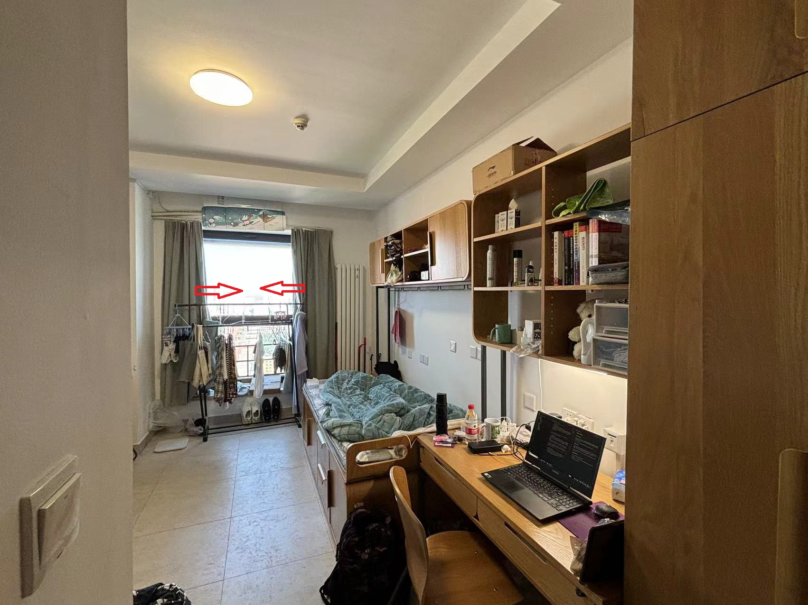
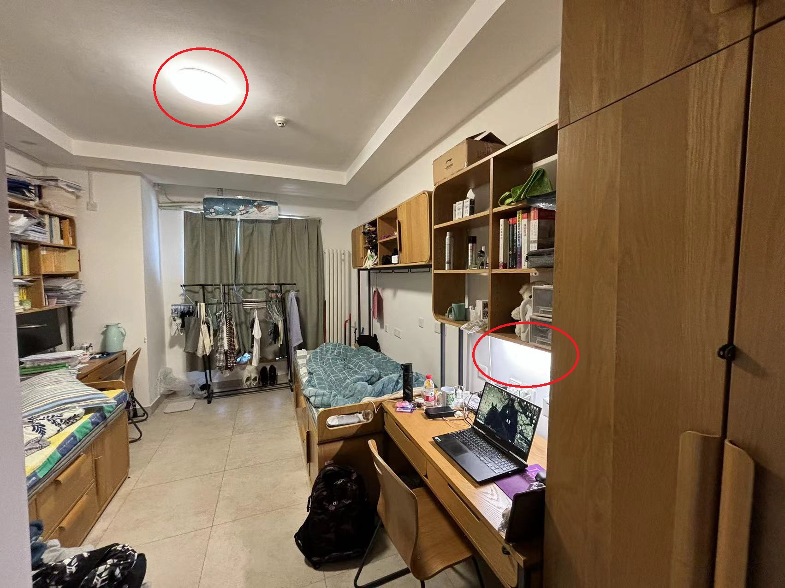
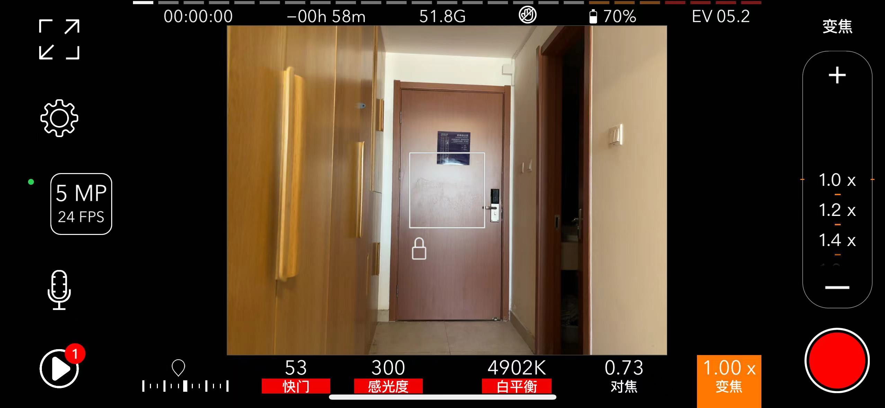
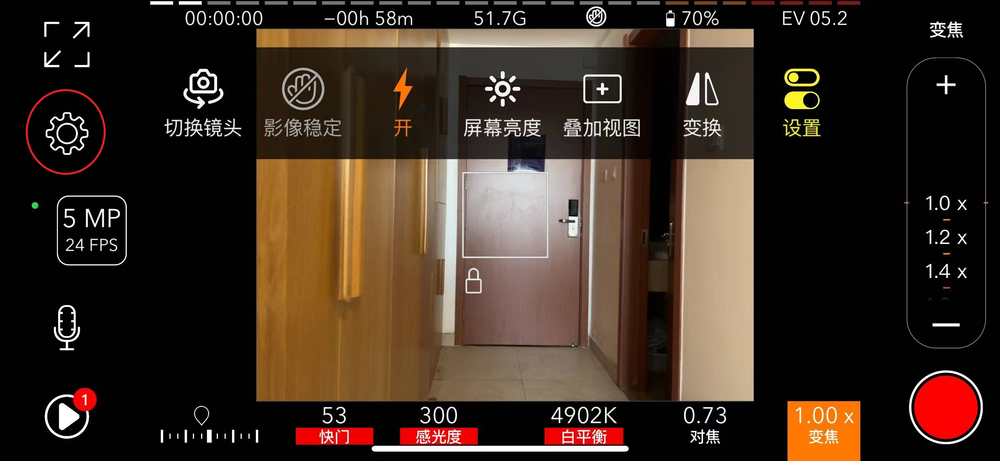
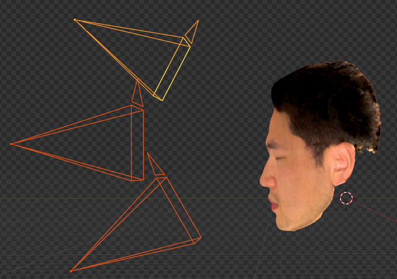
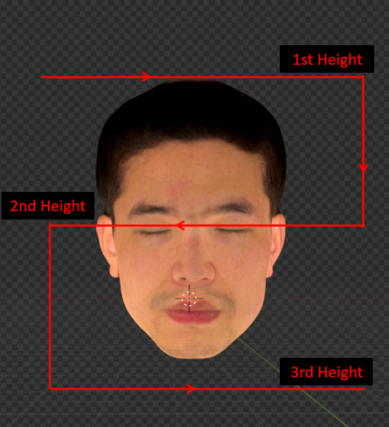

# Data Capture
## Capture Device
Any smartphone with a flashlight is OK.
**The results would be better if the flashlight is close to the camera** as we assume the flashlight shares the same position with the camera in our method (co-located capture setup).

All the results shown in the paper are obtained by videos captured by an IPhone X.

Note the flashlight color and intensity and gamma (convert the srgb space to linear space) differ across different types of smartphones, you can set it in the config:
```
light: {
  intensity: 8.,
  color: [1, 1.25, 0.7],
  gamma: 2.2,
}
```

## Capture Site
To ensure that the smartphone flashlight is the dominant light source to meet our assumption, we suggest capturing data in a bedroom at night or other times with curtains drawn.
Besides, you should turn off all other lamps (e.g., the roof lights or the lamp on the table) in your bedroom.

Here is an example to illustrate how to make my dormitory at Tsinghua University meet the data-capture standard of CoRA.
The photo of my bedroom looks like this:



First, draw the curtain:



Then, close other light sources, including a roof light and a lamp on the table indicated by the right circle:



Now, my bedroom is OK for data capture!

## Capture Software
The software should meet the following standards:
* it supports fixing the exposure during video capture to ensure high-quality inverse rendering results
* it allows the smartphone flashlight to be opened up during video capture

We use [ProMovie](https://promovieapp.com/) for data capture which can be downloaded from the AppStore for IOS users.
For Android users, please find appropriate software by yourself and pull a request to tell us if you succeed; thanks in advance. 

If you are using ProMovie for data capture, we suggest you set the shutter speed of the camera to around 53, the ISO to 300, and the white balance to 4900K:



Before capturing the data, open the smartphone flashlight by clicking the gear button (marked by the red circle in the figure below) on the left:



## Tips
For the person being photographed: 
* **try your best to keep still** as our method is designed for static scene reconstruction
* **looking at a fixed direction** as we find the eyes would unintentionally look at the camera during data capture
* clean background (e.g., back against the white wall) is preferred to make the segmentation algorithm work better

For the person who captures the data:
* ensure the whole face appears in each frame
* moving slowly to avoid motion blur
* mimic the camera trajectory of the example video provided by us to ensure enough views

We describe our camera trajectory here.
We record the video at three different heights, as shown in the figure below:



At each height, we capture an ear-to-ear video surrounding the subjects to cover enough views of the face.
To speed up the capture process, we adopt the camera trajectory shown below.

We start from the first height (the highest one).
At the first height, we shoot video from left to right. 
Then, we turn down the camera to the second height.
At the second height, we shoot video from right to left.
Again, we turn down the camera to the third height (the lowest one).
At the third height, we shoot video from left to right.
See the figure below for the camera trajectory.


