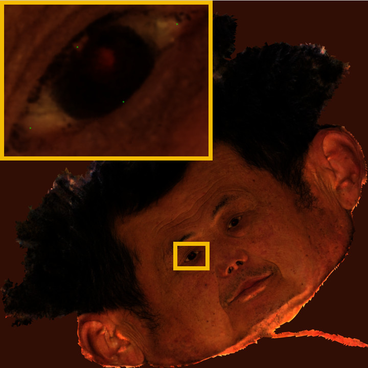
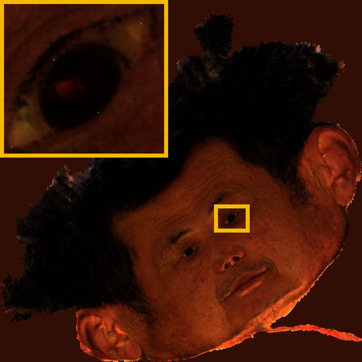

# Running

## Training on the preprocessed dataset
Download a dataset from [here](https://cloud.tsinghua.edu.cn/f/86613e4585af4122b2ae/), e.g. old_neutral.zip.
Then, unzip it in the data folder, the directory structure should be:
```
|-data
    |- old_neutral
        |- hair_mask
        |- image
        |- ...
        |- config.yaml
        |- transforms.json
    |- ...
```

Running on the preprocessed dataset, using `cuda:0`:
```
python trainer.py --config_path data/old_neutral/config.yaml --device 0
```

## Export relightable assets
```
python trainer.py \
    --config_path data/old_neutral/config.yaml \
    --ckpt_path workspace/old_neutral/latest.pth \
    --save_visual_dir workspace/export/old_neutral \
    --mode export_eyeball \
    --chunk_size 16384 \
    --device 0
```

## Training on your own dataset
### Step 1
In the first step, the goal is to obtain the (1) right and left eye mask for each frame and (2) some 3D landmarks on the eyeballs. We disable the hybrid representation in this step: 
```
python trainer.py --config_path data/old_neutral/config_wo-hybrid.yaml --device 0
```

After training, we export the relightable assets from it:
```
python trainer.py \
    --config_path data/old_neutral/config_wo-hybrid.yaml \
    --ckpt_path workspace/cora/old_neutral_wo-hybrid/latest.pth \
    --save_visual_dir workspace/export/old_neutral_wo-hybrid \
    --mode export_eyeball \
    --chunk_size 16384 \
    --device 0
```

We manually label the left eye and right eye mask on the UV diffuse map. See the example images `diffuse_leye_mask.png` and `diffuse_reye_mask.png` in the [provided dataset](https://cloud.tsinghua.edu.cn/f/86613e4585af4122b2ae/) (the eyes region is painted with RGB [1,1,1]) for reference:


Then, we can render the left and right eye mask by running this command:
```
python scripts/render_uv_eye_mask.py \
    --data_root data/old_neutral \
    --mesh_uv_path workspace/export/old_neutral_wo-hybrid/mesh_uv.obj
```

Next, we manually label the eyeball landmarks on the UV diffuse map. See the example images `diffuse_leye_landmark.png` and `diffuse_reye_landmark.png` in the [provided dataset](https://cloud.tsinghua.edu.cn/f/86613e4585af4122b2ae/)(4 landmarks are painted with RGB [0,1,0] for each eye) for reference:




Using the following scripts, we can convert it to 3D landmarks:
```
# for left eye
python scripts/print_3d_eyeball_landmarks.py \
    --ldm_img_path data/old_neutral/diffuse_leye_landmark.png \
    --coord_path workspace/export/old_neutral_wo-hybrid/coord.pkl
# for right eye
python scripts/print_3d_eyeball_landmarks.py \
    --ldm_img_path data/old_neutral/diffuse_reye_landmark.png \
    --coord_path workspace/export/old_neutral_wo-hybrid/coord.pkl
```

After running the above scripts, you need to copy the printed 3D landmark position list to the config file like this:
```
data: {
    ...
    left_eye_ldm: [
        [-0.2853277623653412, 0.06871829926967621, 0.248100146651268],
        [-0.3563520014286041, 0.0770021602511406, 0.24544201791286469],
        [-0.3374285399913788, 0.03722478821873665, 0.24707964062690735],
        [-0.3867684602737427, 0.03126110881567001, 0.21448980271816254],
    ],
    right_eye_ldm: [
        [0.06962595134973526, 0.1554494947195053, 0.3642164170742035],
        [0.00429929792881012, 0.17564578354358673, 0.36422595381736755],
        [0.011260660365223885, 0.13016416132450104, 0.3623243272304535],
        [-0.044418856501579285, 0.13413679599761963, 0.3284035921096802],
    ],
    ...
}
```
See `data/old_neutral/config.yaml` for the reference.

*Note: All the things done in Step 1 can be replaced by the automatic method detailed as follow. We can use the face parsing network to obtain the left and right eye mask for each frame and the landmark detection method (triangularize multi-view 2D landmarks) to obtain 3D eyeball landmarks. We empirically find manually label these things produce better results so in the released code we suggest you to also do these things manually.*

<details>
<summary>Make Step 1 Fully-Automatic</summary>

First, we describe how to obtain the right and left eye mask for each frame.
We use [face-parsing.PyTorch](https://github.com/zllrunning/face-parsing.PyTorch.git). 
Download the [weight](https://drive.google.com/file/d/154JgKpzCPW82qINcVieuPH3fZ2e0P812/view?usp=drive_open) and put it into `scripts/AutoEyeMask`.
Run the following command:
```
cd scripts/AutoEyeMask
python scripts/AutoEyeMask/compute_eye_mask.py \
    --data_root data/old_neutral
cd ../..
```

Then, we describe how to compute 3D eyeball landmarks.
We use the tools provided by iBug.
Install [face_detection](https://github.com/hhj1897/face_detection):
```
git clone https://github.com/hhj1897/face_detection.git
cd face_detection
git lfs pull
pip install -e .
cd ..
```
Install [face_alignment](https://github.com/hhj1897/face_alignment):
```
git clone https://github.com/hhj1897/face_alignment.git
cd face_alignment
pip install -e .
cd ..
```

Detect 2D landmarks on some manually-selected nearly-frontal view.
If you want to run this scripts on other subjects, you need to modify the `img_pth_list` in `compute_2d_eyeball_landmark.py` according to your dataset.
```
python scripts/compute_2d_eyeball_landmark.py \
    --data_root data/old_neutral
```
Compute 3D landmarks via triangularization. 
After running the following script, you need to copy the printed 3D landmark information to the config file.
```
python scripts/compute_3d_eyeball_landmark.py \
    --data_root data/old_neutral
```
</details>

### Step 2
In the second step, we have already obtain the eyes mask and the 3D eyeball landmarks, we can diretly run the full method as using our preprocessed dataset:

```
python trainer.py --config_path data/old_neutral/config.yaml --device 0
```
